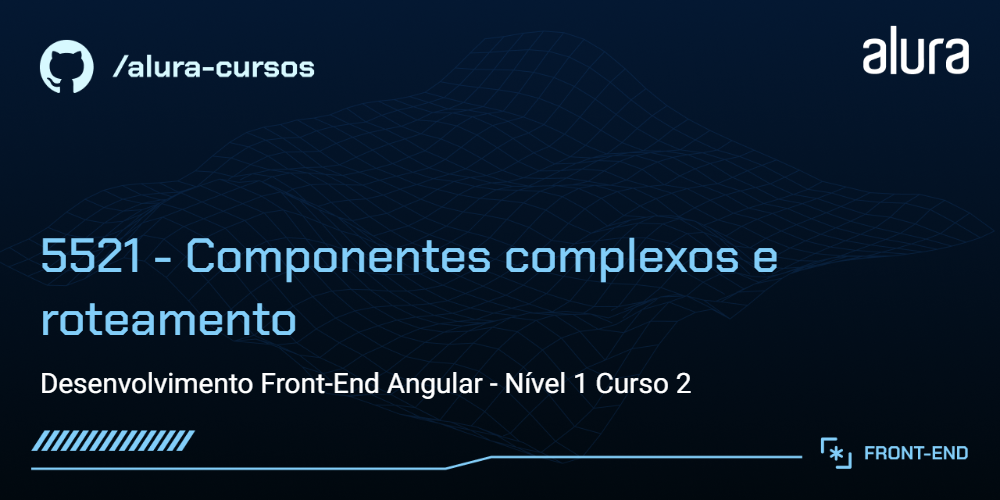

# UseDev - E-commerce de produtos geeks 

Um projeto prático desenvolvido passo a passo para quem já tem o básico de Angular e quer evoluir para construir aplicações mais organizadas, escaláveis e com experiência moderna. Ao longo do curso, criamos um app de ecommerce para selecionar produtos, navegar entre páginas de lista, detalhe e carrinho e aprimorar a comunicação e estado entre componentes, serviços e rotas.

## 🔨 Funcionalidades do projeto

* Exibição de lista de produtos
* Navegação entre lista, detalhe e carrinho
* Adicionar e remover itens do carrinho
* Manter o header atualizado com o total de items no carrinho


## ✔️ Técnicas e tecnologias utilizadas

O desenvolvimento do projeto aborda as seguintes técnicas e tecnologias:

* **Signal, Computed e Effect**: Gerenciamento de estado e persistência no localStorage
* **Binding e Control Flow**: Para trazer dinamismo aos templates
* **Componentização**: Componentes reutilizáveis, componentes de layout e páginas, e como organizar sua estrutura em pastas/hierarquia visual
* **Input/Output**: Como o componente recebe dados e envia eventos entre pai/filho
* **Services**: Serviço global para armazenar lista de produtos e compartilhar estado do carrinho
* **Persistência local com localStorage**: Salva o carrinho mesmo recarregando a página
* **Boas práticas de organização de código**

## 🛠️ Como rodar o projeto

Após baixar o projeto, siga os passos abaixo para executar localmente:

1. Certifique-se de que você já tem Node.js instalado, versão v22.12.0 ou acima ([guia oficial](https://nodejs.org/en/download/))
2. Certifique-se de que você já tem o Angular CLI instalado, versão v21.0.6 ou acima ([guia oficial](https://angular.dev/installation)), a instalação é feita no terminal:

```bash
npm install -g @angular/cli
```

3. No terminal ainda, navegue até a pasta do projeto e instale as dependências:

```bash
npm install
```

3. Execute o projeto:

```bash
npm start
```

4. Acesse no navegador: [http://localhost:4200](http://localhost:4200)

## 📚 Mais informações do curso

Curtiu o projeto e quer aprender na prática? O passo a passo completo faz parte do segundo curso da carreira Angular da Alura (Nível 1)